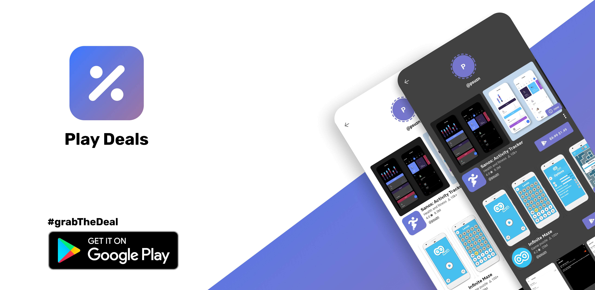

# Play Deals [](https://github.com/psuzn/play-deals-backend/actions/workflows/ci.yaml)



<p>
  <a href="https://play.google.com/store/apps/details?id=me.sujanpoudel.playdeals">
    
  </a>
</p>

Play deals is a simple app to aggregate the paid apps that have ongoing deals and discounts.

This repo contains the codebase for the backend for the actual app. It acts as a place to persist the deals and a
place to add,validate the deals. This backend is built using [Eclipse Vert.x™](https://vertx.io/) and heavily makes use
of kotlin coroutines.

## Development

### Running tests

```shell
./gradlew test
```

### Configuration

Configuration can be done by passing environment variables listed below:

> Best way provide configuration to create a `.env` file with the environmental variables and either
> 1. run `just dev-run` from terminal, OR
> 2. Install [Envfile](https://plugins.jetbrains.com/plugin/7861-envfile) plugin for IntelliJ and run using IntelliJ

| ENV_VAR          | REQUIRED | DEFAULT       | EXAMPLE      | NOTES                                                               |
|------------------|----------|---------------|--------------|:--------------------------------------------------------------------|
| `DB_HOST`        | `Y`      |               | `localhost`  |                                                                     |
| `DB_USERNAME`    | `Y`      |               | `whatever`   |                                                                     |
| `DB_PASSWORD`    | `N`      | `password`    | `whatever`   |                                                                     |
| `DB_PORT`        | `N`      | `5432`        | `6868`       |                                                                     |
| `DB_NAME`        | `N`      | `play_deals`  | `whatever`   |                                                                     |
| `DB_POOL_SIZE`   | `N`      | `5`           | `6`          |                                                                     |
| `ENV`            | `N`      | `PRODUCTION`  | `PRODUCTION` | one of `PRODUCTION or DEVELOPMENT or TEST `                         |
| `APP_PORT`       | `N`      | `8888`        | `9999`       |                                                                     |
| `POSTGRES_IMAGE` | `N`      | `postgres:14` |              | Useful for testing new versions of postgres. Used only in test code |
| `DASHBOARD`      | `N`      | `true`        | `false`      | Whether to enable or not the Jobrunr dashboard                      |
| `DASHBOARD_USER` | `N`      | `admin`       | `whatever`   | Jobrunr dashboard login credential                                  |
| `DASHBOARD_PASS` | `N`      | `admin`       | `whatever`   | Jobrunr dashboard login credential                                  |
| `CORS`           | `N`      | `*`           | `whatever`   | origins allowed for CORS                                            |

## License

MIT License

Copyright (c) 2023 Sujan Poudel

Permission is hereby granted, free of charge, to any person obtaining a copy
of this software and associated documentation files (the "Software"), to deal
in the Software without restriction, including without limitation the rights
to use, copy, modify, merge, publish, distribute, sublicense, and/or sell
copies of the Software, and to permit persons to whom the Software is
furnished to do so, subject to the following conditions:

The above copyright notice and this permission notice shall be included in all
copies or substantial portions of the Software.

THE SOFTWARE IS PROVIDED "AS IS", WITHOUT WARRANTY OF ANY KIND, EXPRESS OR
IMPLIED, INCLUDING BUT NOT LIMITED TO THE WARRANTIES OF MERCHANTABILITY,
FITNESS FOR A PARTICULAR PURPOSE AND NONINFRINGEMENT. IN NO EVENT SHALL THE
AUTHORS OR COPYRIGHT HOLDERS BE LIABLE FOR ANY CLAIM, DAMAGES OR OTHER
LIABILITY, WHETHER IN AN ACTION OF CONTRACT, TORT OR OTHERWISE, ARISING FROM,
OUT OF OR IN CONNECTION WITH THE SOFTWARE OR THE USE OR OTHER DEALINGS IN THE
SOFTWARE.
